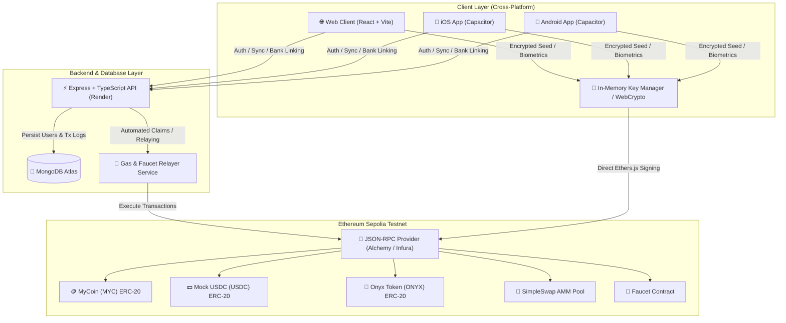

# 💎 Onyx Crypto Wallet & AMM Protocol

[](https://sepolia.etherscan.io/)
[](https://soliditylang.org/)
[](https://vitejs.dev/)
[](https://nodejs.org/)
[](https://www.mongodb.com/)
[-119EFF?logo=capacitor&logoColor=white)](https://capacitorjs.com/)
[](https://codemagic.io/)
[](https://opensource.org/licenses/MIT)

**Onyx** is an institutional-grade, non-custodial cryptocurrency wallet, portfolio tracker, and constant-product Automated Market Maker (AMM) decentralized exchange. Built with a cross-platform architecture (Web, iOS, and Android), Onyx features client-side encrypted key derivation, full on-chain Ethereum Sepolia smart contract integrations, automated token faucet relaying, real-time transaction syncing, and customizable user profiles.

---

## 🌟 Key Features

- **🔐 Non-Custodial & Secure Key Management**: 
  - Standard BIP-39 mnemonic seed phrase generation.
  - In-memory key isolation with zero plaintext disk persistence.
  - Client-side **AES-GCM-256** authenticated encryption with **PBKDF2** (100,000 rounds, SHA-256) password derivation.
  - Native Biometric Authentication (FaceID / Fingerprint) for mobile devices.
- **🔄 Constant-Product AMM DEX (`SimpleSwap.sol`)**:
  - Uniswap V2-style $x \times y = k$ invariant swap pool between `MYC` and `USDC`.
  - 0.3% LP fee distribution model with dynamic slippage tolerance protection (`minAmountOut`).
  - Real-time marginal price calculations and price impact estimation.
- **🚰 On-Chain Token Faucet with Smart Relaying**:
  - Automated faucet delivering test tokens (`MYC`, `USDC`, `ONYX`) directly to user wallets.
  - Multi-stage transaction progress tracker with 24-hour cooldown timer enforcement.
- **📊 Real-Time Portfolio & Transaction Analytics**:
  - Live asset breakdown with togglable interactive donut visualizer.
  - Real-time balance polling, transaction history indexing with direct Etherscan deep links, and dynamic AMM PnL calculation.
- **📱 Cross-Platform Mobile & Web**:
  - Fully responsive, Stitch-inspired dark institutional design system with safe-area insets.
  - Native iOS & Android builds powered by **Capacitor 6** and automated through **Codemagic CI/CD**.
- **☁️ Cloud Backend & Profile Synchronization**:
  - Node.js/Express backend connected to MongoDB Atlas for encrypted profile data, avatar selection, linked mock bank accounts, and transaction audit trails.

---

## 🏗️ System Architecture



---

## 🚀 Live Smart Contracts (Ethereum Sepolia)

All contracts are deployed and verified on Sepolia Etherscan:

| Contract | Symbol / Type | Address | Verified Source Code |
| :--- | :---: | :--- | :--- |
| **MyCoin** | `MYC` (ERC-20) | `0x7565C3D6919B9C5aEC062137D7Be2eB44a778a47` | [View on Etherscan](https://sepolia.etherscan.io/address/0x7565C3D6919B9C5aEC062137D7Be2eB44a778a47#code) |
| **Mock USDC** | `USDC` (ERC-20, 6 dec) | `0xd789569B69de9D41331144AA8F4C9fFc94a2aa95` | [View on Etherscan](https://sepolia.etherscan.io/address/0xd789569B69de9D41331144AA8F4C9fFc94a2aa95#code) |
| **Onyx Token** | `ONYX` (ERC-20) | `0xcF7216A908ABD619C40334DF831885FA701881C3` | [View on Etherscan](https://sepolia.etherscan.io/address/0xcF7216A908ABD619C40334DF831885FA701881C3#code) |
| **Faucet** | Test Token Dispenser | `0x7aC8d5458484c9Da2aA64282394d7544942F1D5d` | [View on Etherscan](https://sepolia.etherscan.io/address/0x7aC8d5458484c9Da2aA64282394d7544942F1D5d#code) |
| **SimpleSwap AMM** | `LP` (Constant-Product Pool) | `0x91cE36C68a21FCf706307FD09Fe59A7408724650` | [View on Etherscan](https://sepolia.etherscan.io/address/0x91cE36C68a21FCf706307FD09Fe59A7408724650#code) |

---

## 📈 Automated Market Maker (AMM) Mathematics

`SimpleSwap.sol` implements a deterministic constant-product liquidity pool matching Uniswap V2 mechanics:

### 1. Invariant Equation
The pool holds reserve balances $x$ (MyCoin) and $y$ (Mock USDC). Every trade must preserve the invariant $k$:
$$x \cdot y = k$$

### 2. Output Calculation with Protocol Fee
A **0.3% fee** ($\gamma = 0.997$) is retained to incentivize liquidity providers. When swapping an amount $\Delta x$ of token $x$ for $\Delta y$ of token $y$:
$$(x + \Delta x \cdot 0.997) \cdot (y - \Delta y) = x \cdot y$$

Solving for output amount $\Delta y$:
$$\Delta y = \frac{\Delta x \cdot 0.997 \cdot y}{x + \Delta x \cdot 0.997}$$

### 3. Price Impact & Slippage Protection
- **Marginal Spot Price**: $P_{\text{spot}} = \frac{y}{x}$
- **Effective Execution Price**: $P_{\text{exec}} = \frac{\Delta y}{\Delta x}$
- **Price Impact**:
  $$\text{Price Impact} (\%) = \left(1 - \frac{P_{\text{exec}}}{P_{\text{spot}}}\right) \times 100$$
- **On-Chain Slippage Enforcement**: Transactions verify `require(amountOut >= minAmountOut, "INSUFFICIENT_OUTPUT_AMOUNT")` to prevent front-running and MEV sandwich attacks.

---

## 📁 Repository Structure

```text
onyx/
├── backend/                  # Node.js + Express + TypeScript API
│   ├── src/
│   │   ├── middleware/       # JWT authentication & request validation
│   │   ├── models/           # Mongoose schemas (User, Transaction, Bank)
│   │   ├── routes/           # Auth, Bank, Faucet, and Tx routes
│   │   └── index.ts          # Server entrypoint & DB connection
│   └── package.json
├── frontend/                 # React 18 + Vite + Tailwind + Capacitor App
│   ├── android/              # Native Android project configuration
│   ├── ios/                  # Native iOS project configuration
│   ├── src/
│   │   ├── components/       # UI components (Swap, Faucet, SendReceive, TxHistory)
│   │   ├── context/          # WalletContext & global state management
│   │   ├── utils/            # WebCrypto encryption, contracts & RPC helpers
│   │   └── App.tsx           # Navigation & core layout
│   ├── capacitor.config.ts   # Mobile runtime configuration
│   └── package.json
├── hardhat/                  # Solidity smart contracts & tests
│   ├── contracts/            # ERC-20 tokens, Faucet, and SimpleSwap AMM
│   ├── scripts/              # Automated deployment & Etherscan verification
│   ├── test/                 # Chai & Hardhat unit test suites
│   └── hardhat.config.ts
├── codemagic.yaml            # iOS & Android mobile CI/CD pipelines
└── render.yaml               # Backend Render cloud hosting deployment spec
```

---

## ⚙️ Environment Variables

### 1. `backend/.env`
```env
PORT=5001
MONGODB_URI=mongodb+srv://<username>:<password>@cluster.mongodb.net/onyx?retryWrites=true&w=majority
JWT_SECRET=your_super_secret_jwt_key
SEPOLIA_RPC_URL=https://sepolia.infura.io/v3/YOUR_INFURA_KEY
FAUCET_PRIVATE_KEY=your_faucet_relayer_private_key
```

### 2. `frontend/.env`
```env
VITE_API_URL=http://localhost:5001
VITE_SEPOLIA_RPC_URL=https://sepolia.infura.io/v3/YOUR_INFURA_KEY
VITE_MYCOIN_ADDRESS=0x7565C3D6919B9C5aEC062137D7Be2eB44a778a47
VITE_USDC_ADDRESS=0xd789569B69de9D41331144AA8F4C9fFc94a2aa95
VITE_ONYX_ADDRESS=0xcF7216A908ABD619C40334DF831885FA701881C3
VITE_FAUCET_ADDRESS=0x7aC8d5458484c9Da2aA64282394d7544942F1D5d
VITE_SWAP_ADDRESS=0x91cE36C68a21FCf706307FD09Fe59A7408724650
```

### 3. `hardhat/.env`
```env
SEPOLIA_RPC_URL=https://sepolia.infura.io/v3/YOUR_INFURA_KEY
PRIVATE_KEY=your_deployer_private_key
ETHERSCAN_API_KEY=your_etherscan_api_key
```

---

## 🛠️ Local Development & Setup

### Prerequisites
- [Node.js](https://nodejs.org/) (v18 or higher)
- [npm](https://www.npmjs.com/)
- [MongoDB](https://www.mongodb.com/) (Local or Atlas instance)

### 1. Smart Contract Development
```bash
cd hardhat
npm install

# Compile contracts
npx hardhat compile

# Run test suite
npx hardhat test

# Deploy to local Hardhat node
npx hardhat node
npx hardhat run scripts/deploy.ts --network localhost

# Deploy to Sepolia testnet & verify
npx hardhat run scripts/deploy.ts --network sepolia
```

### 2. Backend Server
```bash
cd backend
npm install

# Run backend development server with hot-reload
npm run dev

# Build for production
npm run build
npm start
```

### 3. Frontend Web Application
```bash
cd frontend
npm install

# Start Vite development server
npm run dev

# Build production bundle
npm run build
```

---

## 📱 Mobile App Development (iOS & Android)

The Onyx mobile client is powered by Capacitor:

```bash
cd frontend

# Build web assets and sync to native projects
npm run build
npx cap sync

# Open in Xcode (macOS only)
npx cap open ios

# Open in Android Studio
npx cap open android
```

### Automated Mobile CI/CD (Codemagic)
The repository includes `codemagic.yaml` supporting:
- **`capacitor-ios-workflow`**: Compiles the web assets, syncs Capacitor iOS, installs pods, and builds a simulator `.zip` artifact on an Apple Silicon M2 instance.
- **`capacitor-android-workflow`**: Compiles web assets, syncs Capacitor Android, and builds a debug APK via `./gradlew assembleDebug`.

---

## ☁️ Production Deployment

### Backend Deployment (Render)
The repository includes `render.yaml` for zero-configuration deployment on [Render](https://render.com/):
1. Connect your GitHub repository to Render.
2. Select **Blueprint** and Render will automatically detect `render.yaml`.
3. Set your secret environment variables (`MONGODB_URI`, `JWT_SECRET`, `FAUCET_PRIVATE_KEY`, etc.) in the dashboard.

### Frontend Web Hosting (Vercel / Netlify)
The frontend builds as an optimized static single-page app (SPA):
```bash
cd frontend
npm install -g vercel
vercel
```
Set the output directory to `dist` and provide the relevant `VITE_*` environment variables in your hosting dashboard.

---

## 📄 License

This project is licensed under the [MIT License](LICENSE).
