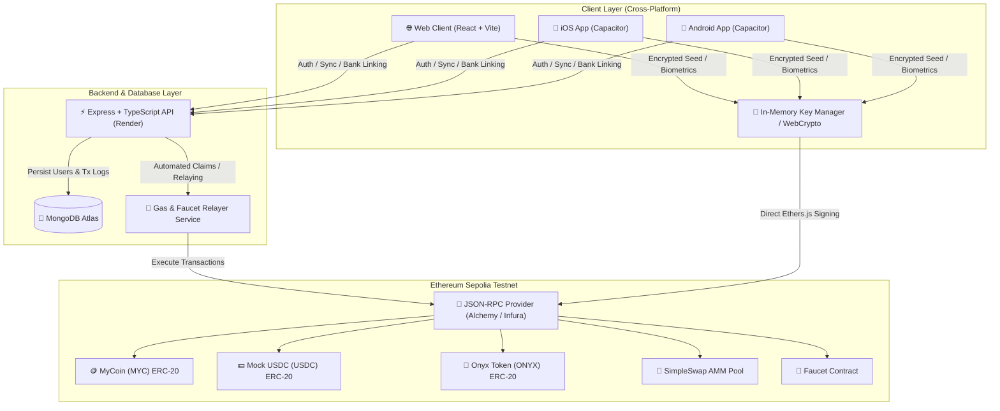

# 💎 Onyx Crypto Wallet & AMM Protocol

[](https://sepolia.etherscan.io/)
[](https://soliditylang.org/)
[](https://vitejs.dev/)
[](https://nodejs.org/)
[](https://www.mongodb.com/)
[-119EFF?logo=capacitor&logoColor=white)](https://capacitorjs.com/)
[](https://codemagic.io/)
[](https://opensource.org/licenses/MIT)

**Onyx** is an institutional-grade, non-custodial cryptocurrency wallet, portfolio tracker, and constant-product Automated Market Maker (AMM) decentralized exchange. Built with a cross-platform architecture (Web, iOS, and Android), Onyx features client-side encrypted key derivation, full on-chain Ethereum Sepolia smart contract integrations, automated token faucet relaying, real-time transaction syncing, and customizable user profiles.

---

## 🌟 Key Features

- **🔐 Non-Custodial & Secure Key Management**: 
  - Standard BIP-39 mnemonic seed phrase generation.
  - In-memory key isolation with zero plaintext disk persistence.
  - Client-side **AES-GCM-256** authenticated encryption with **PBKDF2** (100,000 rounds, SHA-256) password derivation.
  - Native Biometric Authentication (FaceID / Fingerprint) for mobile devices.
- **🔄 Constant-Product AMM DEX (`SimpleSwap.sol`)**:
  - Uniswap V2-style $x \times y = k$ invariant swap pool between `MYC` and `USDC`.
  - 0.3% LP fee distribution model with dynamic slippage tolerance protection (`minAmountOut`).
  - Real-time marginal price calculations and price impact estimation.
- **🚰 On-Chain Token Faucet with Smart Relaying**:
  - Automated faucet delivering test tokens (`MYC`, `USDC`, `ONYX`) directly to user wallets.
  - Multi-stage transaction progress tracker with 24-hour cooldown timer enforcement.
- **📊 Real-Time Portfolio & Transaction Analytics**:
  - Live asset breakdown with togglable interactive donut visualizer.
  - Real-time balance polling, transaction history indexing with direct Etherscan deep links, and dynamic AMM PnL calculation.
- **📱 Cross-Platform Mobile & Web**:
  - Fully responsive, Stitch-inspired dark institutional design system with safe-area insets.
  - Native iOS & Android builds powered by **Capacitor 6** and automated through **Codemagic CI/CD**.
- **☁️ Cloud Backend & Profile Synchronization**:
  - Node.js/Express backend connected to MongoDB Atlas for encrypted profile data, avatar selection, linked mock bank accounts, and transaction audit trails.

---

## 🏗️ System Architecture



---

## 🚀 Live Smart Contracts (Ethereum Sepolia)

All contracts are deployed and verified on Sepolia Etherscan:

| Contract | Symbol / Type | Address | Verified Source Code |
| :--- | :---: | :--- | :--- |
| **MyCoin** | `MYC` (ERC-20) | `0x7565C3D6919B9C5aEC062137D7Be2eB44a778a47` | [View on Etherscan](https://sepolia.etherscan.io/address/0x7565C3D6919B9C5aEC062137D7Be2eB44a778a47#code) |
| **Mock USDC** | `USDC` (ERC-20, 6 dec) | `0xd789569B69de9D41331144AA8F4C9fFc94a2aa95` | [View on Etherscan](https://sepolia.etherscan.io/address/0xd789569B69de9D41331144AA8F4C9fFc94a2aa95#code) |
| **Onyx Token** | `ONYX` (ERC-20) | `0xcF7216A908ABD619C40334DF831885FA701881C3` | [View on Etherscan](https://sepolia.etherscan.io/address/0xcF7216A908ABD619C40334DF831885FA701881C3#code) |
| **Faucet** | Test Token Dispenser | `0x7aC8d5458484c9Da2aA64282394d7544942F1D5d` | [View on Etherscan](https://sepolia.etherscan.io/address/0x7aC8d5458484c9Da2aA64282394d7544942F1D5d#code) |
| **SimpleSwap AMM** | `LP` (Constant-Product Pool) | `0x91cE36C68a21FCf706307FD09Fe59A7408724650` | [View on Etherscan](https://sepolia.etherscan.io/address/0x91cE36C68a21FCf706307FD09Fe59A7408724650#code) |

---

## 📈 Automated Market Maker (AMM) Mathematics

`SimpleSwap.sol` implements a deterministic constant-product liquidity pool matching Uniswap V2 mechanics:

### 1. Invariant Equation
The pool holds reserve balances $x$ (MyCoin) and $y$ (Mock USDC). Every trade must preserve the invariant $k$:
$$x \cdot y = k$$

### 2. Output Calculation with Protocol Fee
A **0.3% fee** ($\gamma = 0.997$) is retained to incentivize liquidity providers. When swapping an amount $\Delta x$ of token $x$ for $\Delta y$ of token $y$:
$$(x + \Delta x \cdot 0.997) \cdot (y - \Delta y) = x \cdot y$$

Solving for output amount $\Delta y$:
$$\Delta y = \frac{\Delta x \cdot 0.997 \cdot y}{x + \Delta x \cdot 0.997}$$

### 3. Price Impact & Slippage Protection
- **Marginal Spot Price**: $P_{\text{spot}} = \frac{y}{x}$
- **Effective Execution Price**: $P_{\text{exec}} = \frac{\Delta y}{\Delta x}$
- **Price Impact**:
  $$\text{Price Impact} (\%) = \left(1 - \frac{P_{\text{exec}}}{P_{\text{spot}}}\right) \times 100$$
- **On-Chain Slippage Enforcement**: Transactions verify `require(amountOut >= minAmountOut, "INSUFFICIENT_OUTPUT_AMOUNT")` to prevent front-running and MEV sandwich attacks.

---

## ⚙️ Environment Variables

### 1. `backend/.env`
```env
PORT=5001
MONGODB_URI=mongodb+srv://<username>:<password>@cluster.mongodb.net/onyx?retryWrites=true&w=majority
JWT_SECRET=your_super_secret_jwt_key
SEPOLIA_RPC_URL=https://sepolia.infura.io/v3/YOUR_INFURA_KEY
FAUCET_PRIVATE_KEY=your_faucet_relayer_private_key
```

### 2. `frontend/.env`
```env
VITE_API_URL=http://localhost:5001
VITE_SEPOLIA_RPC_URL=https://sepolia.infura.io/v3/YOUR_INFURA_KEY
VITE_MYCOIN_ADDRESS=0x7565C3D6919B9C5aEC062137D7Be2eB44a778a47
VITE_USDC_ADDRESS=0xd789569B69de9D41331144AA8F4C9fFc94a2aa95
VITE_ONYX_ADDRESS=0xcF7216A908ABD619C40334DF831885FA701881C3
VITE_FAUCET_ADDRESS=0x7aC8d5458484c9Da2aA64282394d7544942F1D5d
VITE_SWAP_ADDRESS=0x91cE36C68a21FCf706307FD09Fe59A7408724650
```

### 3. `hardhat/.env`
```env
SEPOLIA_RPC_URL=https://sepolia.infura.io/v3/YOUR_INFURA_KEY
PRIVATE_KEY=your_deployer_private_key
ETHERSCAN_API_KEY=your_etherscan_api_key
```

---

## 🛠️ Local Development & Setup

### Prerequisites
- [Node.js](https://nodejs.org/) (v18 or higher)
- [npm](https://www.npmjs.com/)
- [MongoDB](https://www.mongodb.com/) (Local or Atlas instance)

### 1. Smart Contract Development
```bash
cd hardhat
npm install

# Compile contracts
npx hardhat compile

# Run test suite
npx hardhat test

# Deploy to local Hardhat node
npx hardhat node
npx hardhat run scripts/deploy.ts --network localhost

# Deploy to Sepolia testnet & verify
npx hardhat run scripts/deploy.ts --network sepolia
```

### 2. Backend Server
```bash
cd backend
npm install

# Run backend development server with hot-reload
npm run dev

# Build for production
npm run build
npm start
```

### 3. Frontend Web Application
```bash
cd frontend
npm install

# Start Vite development server
npm run dev

# Build production bundle
npm run build
```

---

## 📱 Mobile Application Setup (iOS & Android)

The Onyx mobile applications are built using **Capacitor 6**, which packages the React application into native container projects for iOS (Swift/Xcode) and Android (Kotlin/Gradle).

### Prerequisites for Mobile Development

| Platform | Requirements |
| :--- | :--- |
| **Common** | Node.js v18+, npm, and global Capacitor CLI (`npm install -g @capacitor/cli`) |
| **iOS** | macOS computer, **Xcode 15+**, Command Line Tools (`xcode-select --install`), CocoaPods (`sudo gem install cocoapods`) |
| **Android** | Windows / macOS / Linux, **Android Studio (Ladybug or later)**, **JDK 17**, Android SDK (API Level 33+) |

---

### Step 1: Build Web Assets & Sync Native Projects

Before launching or building iOS/Android apps, always compile the latest web bundle and sync Capacitor:

```bash
cd frontend

# 1. Install frontend dependencies
npm install

# 2. Build the production React bundle into /dist
npm run build

# 3. Sync web assets and Capacitor plugins to both native projects
npx cap sync
```

> [!TIP]
> Whenever you modify React code in `frontend/src`, run `npm run build && npx cap sync` to propagate the changes into native iOS and Android projects.

---

### 🍏 Step 2: iOS Setup & Execution

#### Option A: Running with Xcode UI (Recommended for Testing & Debugging)

1. Open the native iOS workspace in Xcode:
   ```bash
   cd frontend
   npx cap open ios
   ```
   *(Alternatively, open `frontend/ios/App/App.xcworkspace` directly in Xcode)*.

2. **Configure Code Signing**:
   - In Xcode's left sidebar, select the root **App** project.
   - Go to the **Signing & Capabilities** tab.
   - Under **Signing**, check **Automatically manage signing** and select your **Apple Developer Team** (or Personal Team).
   - Verify that the Bundle Identifier is set to `com.onyx.wallet`.

3. **Run in iOS Simulator**:
   - In the top toolbar device selector, choose any simulator (e.g., **iPhone 16 Pro**).
   - Press **`Cmd + R`** or click the **▶️ Play** button.

4. **Run on Physical iPhone / iPad**:
   - Connect your iOS device via USB and unlock it.
   - Select your physical device from the device dropdown.
   - Press **`Cmd + R`**.
   - *(First-time setup)*: On your iPhone, navigate to **Settings > General > VPN & Device Management**, tap your developer certificate, and tap **Trust**.

#### Option B: Building via Command Line (Simulator)

To compile a debug simulator build directly from terminal:
```bash
cd frontend/ios/App
xcodebuild build \
  -workspace "App.xcodeproj/project.xcworkspace" \
  -scheme "App" \
  -sdk iphonesimulator \
  -configuration Debug \
  -derivedDataPath build \
  CODE_SIGN_IDENTITY="" \
  CODE_SIGNING_REQUIRED=NO \
  CODE_SIGNING_ALLOWED=NO
```

#### Native iOS Permissions Configured (`Info.plist`)
- `NSFaceIDUsageDescription`: Enables native Face ID biometric authentication to unlock wallets and sign transactions.
- `NSCameraUsageDescription`: Enables camera access for QR-code address scanning.
- `CFBundleURLSchemes`: Configured custom deep-link scheme `onyxapp://`.

---

### 🤖 Step 3: Android Setup & Execution

#### Option A: Running with Android Studio UI

1. Open the Android project in Android Studio:
   ```bash
   cd frontend
   npx cap open android
   ```
   *(Alternatively, launch Android Studio and choose "Open" -> select the `frontend/android` folder)*.

2. **Gradle Sync & SDK Verification**:
   - Wait for Android Studio to index the project and complete the Gradle sync.
   - Ensure the Android SDK Build-Tools and API 33+ are installed via **Tools > SDK Manager**.
   - Ensure Java 17 is set under **Settings > Build, Execution, Deployment > Build Tools > Gradle > Gradle JDK**.

3. **Run on Android Emulator**:
   - Open **Device Manager** in Android Studio and create/start an **Android Virtual Device (AVD)** (e.g. Pixel 8 with API 34).
   - Click the green **▶️ Run 'app'** button (`Shift + F10`).

4. **Run on Physical Android Device**:
   - Enable **Developer Options** and turn on **USB Debugging** on your phone.
   - Connect your phone via USB and allow USB debugging when prompted.
   - Select your physical device in the device dropdown and click **▶️ Run**.

#### Option B: Building Debug APK via Command Line

You can build the Android APK directly using Gradle without opening Android Studio:

```bash
cd frontend/android

# Ensure gradlew has execution permissions
chmod +x gradlew

# Build Debug APK
./gradlew assembleDebug
```

- **Output APK Location**:
  `frontend/android/app/build/outputs/apk/debug/app-debug.apk`

- **Install APK to Connected Device/Emulator**:
  ```bash
  cd frontend/android
  ./gradlew installDebug
  ```

---

### ⚡ Step 4: Live Reload for Mobile Development

To test React UI updates instantly on simulators or physical devices without re-running `cap sync`:

1. Find your computer's local network IP address (e.g. `192.168.1.50`).
2. Temporarily update `frontend/capacitor.config.ts`:
   ```typescript
   import type { CapacitorConfig } from '@capacitor/cli';

   const config: CapacitorConfig = {
     appId: 'com.onyx.wallet',
     appName: 'Onyx Wallet',
     webDir: 'dist',
     server: {
       url: 'http://192.168.1.50:5173', // Your computer's local IP and Vite port
       cleartext: true
     }
   };

   export default config;
   ```
3. Start the Vite dev server with network exposure: `npm run dev -- --host`
4. Sync once: `npx cap sync`
5. Run the app in Xcode or Android Studio. Any code edits in Vite will now hot-reload on the mobile device.

---

### 🚀 Automated Mobile CI/CD (Codemagic)

The repository includes a ready-to-use [`codemagic.yaml`](codemagic.yaml) pipeline for cloud builds:

- **`capacitor-ios-workflow`**: 
  - Runs on macOS M2 VMs.
  - Automatically installs dependencies, builds React assets, runs `cap sync ios`, and compiles a `.zip` containing `App.app` for the iOS Simulator.
- **`capacitor-android-workflow`**:
  - Runs on Linux VMs with Java 17.
  - Compiles web assets, runs `cap sync android`, and runs `./gradlew assembleDebug` to produce standalone `app-debug.apk` build artifacts.

---

## ☁️ Production Deployment

### Backend Deployment (Render)
The repository includes `render.yaml` for zero-configuration deployment on [Render](https://render.com/):
1. Connect your GitHub repository to Render.
2. Select **Blueprint** and Render will automatically detect `render.yaml`.
3. Set your secret environment variables (`MONGODB_URI`, `JWT_SECRET`, `FAUCET_PRIVATE_KEY`, etc.) in the dashboard.

### Frontend Web Hosting (Vercel / Netlify)
The frontend builds as an optimized static single-page app (SPA):
```bash
cd frontend
npm install -g vercel
vercel
```
Set the output directory to `dist` and provide the relevant `VITE_*` environment variables in your hosting dashboard.

---

## 📄 License

This project is licensed under the [MIT License](LICENSE).
