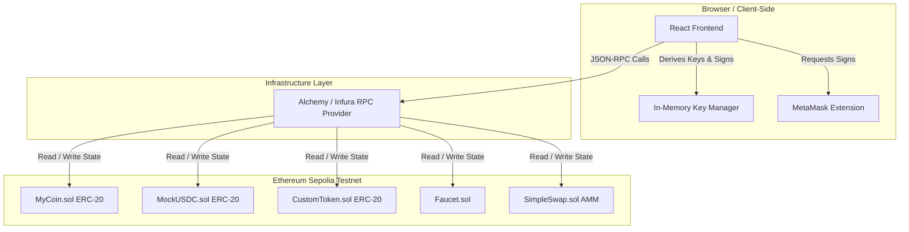

# Onyx Swap & Portfolio Wallet

[](https://sepolia.etherscan.io/)
[](https://soliditylang.org/)
[](https://vitejs.dev/)
[](https://opensource.org/licenses/MIT)

A professional-grade, self-custody portfolio wallet and constant-product Automated Market Maker (AMM) trading pool built for the **Ethereum Sepolia** testnet. The project enables users to generate encrypted, client-side wallets or connect via MetaMask to request free test tokens from an on-chain faucet and trade assets instantly.

---

## 🏗️ Architecture

The diagram below illustrates the relationship between the client-side React frontend, the in-memory/browser key manager, the JSON-RPC network provider, and the smart contracts deployed on-chain:



---

## 🚀 Live Deployed Contracts (Sepolia Testnet)

All smart contracts are fully verified on Etherscan for complete transparency and public code inspection:

| Contract | Token/Symbol | Address | Verification Link |
| :--- | :---: | :--- | :--- |
| **MyCoin Contract** | `MYC` | `0x7565C3D6919B9C5aEC062137D7Be2eB44a778a47` | [Etherscan Code](https://sepolia.etherscan.io/address/0x7565C3D6919B9C5aEC062137D7Be2eB44a778a47#code) |
| **Mock USDC Contract** | `USDC` | `0xd789569B69de9D41331144AA8F4C9fFc94a2aa95` | [Etherscan Code](https://sepolia.etherscan.io/address/0xd789569B69de9D41331144AA8F4C9fFc94a2aa95#code) |
| **Onyx Token Contract** | `ONYX` | `0xcF7216A908ABD619C40334DF831885FA701881C3` | [Etherscan Code](https://sepolia.etherscan.io/address/0xcF7216A908ABD619C40334DF831885FA701881C3#code) |
| **Faucet Contract** | — | `0x7aC8d5458484c9Da2aA64282394d7544942F1D5d` | [Etherscan Code](https://sepolia.etherscan.io/address/0x7aC8d5458484c9Da2aA64282394d7544942F1D5d#code) |
| **SimpleSwap AMM Pool** | `LP` | `0x91cE36C68a21FCf706307FD09Fe59A7408724650` | [Etherscan Code](https://sepolia.etherscan.io/address/0x91cE36C68a21FCf706307FD09Fe59A7408724650#code) |

---

## 📈 The Automated Market Maker (AMM) Math

`SimpleSwap` implements a **Constant-Product Automated Market Maker (AMM)** matching the math of Uniswap V2. 

### 1. The Core Invariant
The pool maintains a reserve of token $x$ (MyCoin) and token $y$ (Mock USDC). Every trade must preserve the constant product invariant:
$$x \times y = k$$

### 2. Swap Math & Fees
The pool levies a **0.3% protocol fee** to reward liquidity providers. When trading an input amount $dx$ of token $x$ for an output amount $dy$ of token $y$, the calculation is:
$$(x + dx \times 0.997) \times (y - dy) = k$$

Solving for $dy$ yields the execution formula:
$$dy = \frac{dx \times 0.997 \times y}{x + dx \times 0.997}$$

### 3. Slippage & Price Impact
* **Price Impact**: Large swaps shift the reserve balance significantly. The UI calculates and displays the expected execution rate deviation from the spot marginal price prior to signing:
  $$\text{Price Impact} \% = \left(1 - \frac{\text{Execution Price}}{\text{Marginal Price}}\right) \times 100$$
* **Slippage Tolerance**: The `SimpleSwap.sol` contract exposes a `minAmountOut` check. If block congestion or concurrent trades shift the execution output below this threshold, the smart contract reverts the transaction to protect user funds.

---

## 🛡️ Security Highlights

1. **In-Memory Private Keys**: Private keys are derived using standard BIP-39 mnemonic phrases. Keys are held strictly in memory (React state) and are never written to disk in plaintext or transmitted over network requests.
2. **Local Password Encryption**: To persist the wallet, the private credentials are encrypted locally using the Web Crypto API utilizing **PBKDF2 key derivation (100,000 iterations, SHA-256)** and **AES-GCM-256 authenticated encryption**.
3. **Reentrancy Protection**: All state-changing methods on the Faucet and AMM inherit from OpenZeppelin's `ReentrancyGuard` and use the `nonReentrant` modifier to protect against recursive draining attacks.
4. **Decimals Normalization**: Supports asymmetric decimals (MYC has 18 decimals, Mock USDC has 6). Dynamic scaling factors are utilized to prevent round-off precision errors.

---

## 🛠️ Installation & Setup

### Prerequisites
* [Node.js](https://nodejs.org/) (v18+)
* [npm](https://www.npmjs.com/)

### 1. Smart Contract Development
Navigate to the hardhat folder:
```bash
cd hardhat
npm install
```
* **Compile Contracts**: `npx hardhat compile`
* **Run Unit Tests**: `npx hardhat test`
* **Start Local Node**: `npx hardhat node`
* **Deploy Locally**: `npx hardhat run scripts/deploy.ts --network localhost`
* **Deploy to Sepolia Testnet**: `npx hardhat run scripts/deploy.ts --network sepolia`

### 2. Frontend Web App
Navigate to the frontend folder:
```bash
cd frontend
npm install
```
* **Run Development Server**: `npm run dev`
* **Build Production Bundle**: `npm run build`

---

## 🌐 Production Hosting

### 1. Smart Contract Verification
When deploying to a public network (like Sepolia), the deploy script automatically invokes the verification plugin to index and verify your contract source files on Etherscan using the `ETHERSCAN_API_KEY` defined in `hardhat/.env`.

### 2. Hosting the Static Web Client
The React + Vite frontend compiles into static web pages that can be hosted for free on **Vercel** or **Netlify**:

* **Vercel CLI Setup**:
  ```bash
  cd frontend
  npm install -g vercel
  vercel
  ```
  Set the output folder configuration to `dist` and configure your environment variables (`VITE_MYCOIN_ADDRESS`, etc.) inside the Vercel Dashboard under **Project Settings > Environment Variables**.
